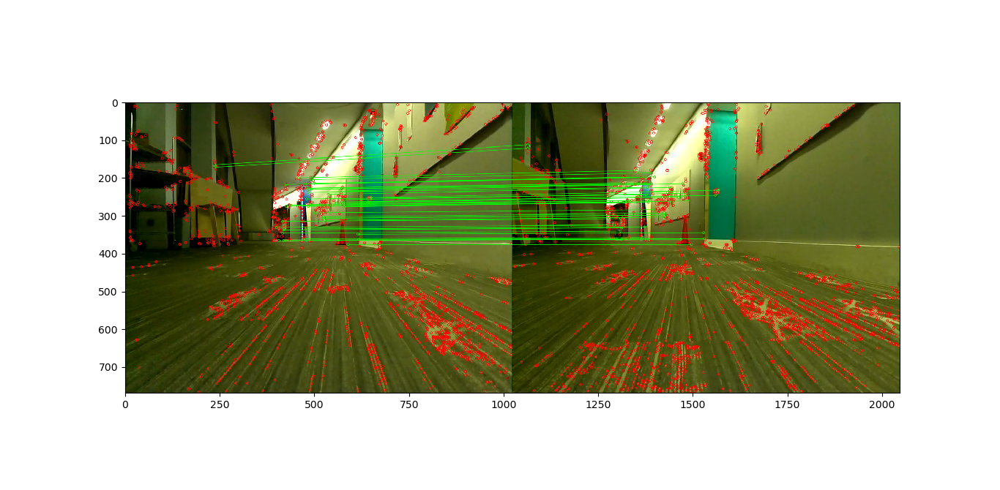
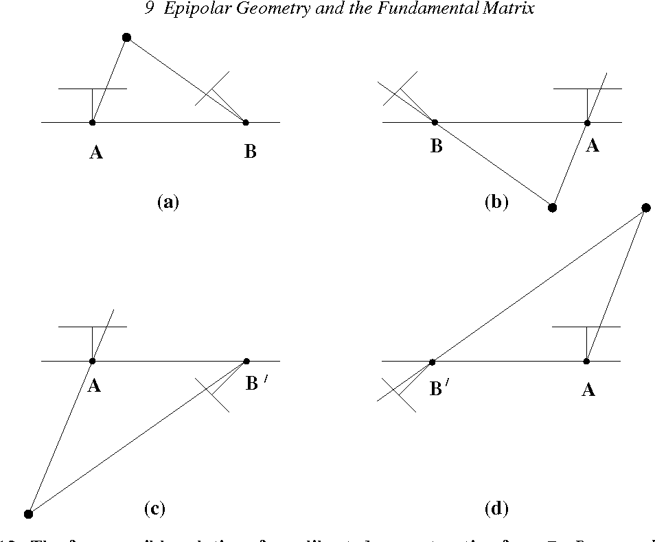

# Estimating Motion from Computer Vision

*ENGR3590: A Computational Introduction to Robotics, Olin College of Engineering, FA2022*

*Computer Vision Project*

*Simrun Mutha, Jackie Zeng and Melody Chiu*

## Introduction

The goal of this project to identify the speed at which a robot is moving based on camera input. We did this by extracting geometric structures from images taken through a camera's motion and using this information to estimate the robot's position at the time each image was taken, relative to where it started. Knowing the time and calculating the robot's approximate position for each camera input allowed us to determine how fast the robot was moving as it was taking the images.

* [Implementation](#implementation)
    * [Image Data](#image-data)
    * [Keypoint Matching](#keypoint-matching)
    * [Matrix Calculations](#matrix-calculations)
    * [Triangulation](#triangulation)
* [Challenges](#challenges)
* [Lessons Learned](#lessons-learned)
* [Next Steps](#next-steps)
* [References](#references)

## Implementation
### Image Data

To collect the images used to estimate motion, we used a [Raspberry Pi camera v1.3](https://www.raspberrypi.com/documentation/accessories/camera.html) connected to the [Neato](https://neatorobotics.com/) robot vacuum. We drove the NEATO in a hallway at a fixed speed of 0.1 m/s and took two pictures that were some distance apart that are [image 1](./image_1.png) and [image 2](./image_2.png). 

In order to get camera intrinsic information from the camera, we had to manuallly calibrate the camera which we did by following the steps outlined [here](https://navigation.ros.org/tutorials/docs/camera_calibration.html). We were able to find our camera matrix, K, from the results of that. 

### Keypoint Matching

The first step to estimating motion from image data is matching features between images. In order to do this, we used SIFT to find keypoints in the images. A good keypoint is any region that will change rapidly if it is moved, for example a corner. Descriptors are extracted from each keypoint which characterize the local appearance around a keypoint. We then used a FLANN based matcher to match the keypoints from the two images. Several of the matches were fairly innacurate at first because the carpeted surface in the picture had a repetitive pattern which led to false matches. To get a good set of keypoints, we implemented a ratio test which checks to see if the second best match is a lot lower than the best match. Here is the final set of keypoints matches:

 Set of matching keypoints 

We were debating whether to use optical flow or SURF initally. Based on online research, we found that optical flow accomodates more points leading to a dense reconstruction and it works best with images taken consecutively by the same camera. This would work well for our situation but we ultimately decided to go with SURF because we didn't need a large number of matches for this problem and we were able to understand the rich feature matching algorithm much more intuitively. 

### Matrix calculations

Once we have two sets of keypoints, we then need to further determine 

* Calculating the fundamental matrix
    - It allows us to relate the 2 cameras in pixel coordinates
    - Essentially, it maps apin in one image to a line in the other image. 
    - Sincefrom two sets of corresponding keypoints the matrix is 3x3, we needed at last 8 points to determine it because it has at max 8 degrees of freedom.
    - To calculate it, we both tried creating out own function implementing the 8 point algorithm. However, this did not work as well as we had hoped... TODO: Jackie try to fix the find fundamanetal matrix function that we have. 
    - If there are more points, RANSAC is used.
* Calculating the essential matrix 
    - The essential matrix takes the fundamental matrix and incorporates 
    - Places the first camera at the origin hypothetically
    - Th
    - Using the 8 point algorithm vs RANSAC to calculate the matches
    - 
* Calculating P2 from F

 Image description 

* Talk about how we get four possible P2s (Melody will talk about how we figure out which one is the correct on)

Once we have the fundamental matrix, we needed to understand

### Triangulation

From the matrix calculations in the step above, we now have all the information we need to reconstruct the scene and verify the accuracy of our math. We can use the canonical first camera (P1) and the second camera (P2), which we calculated from the fundamental matrix, to triangulate our two sets of 2D keypoints into one set of 3D points that should reflect the environment in which the Neato was recording images. Triangulation is the process of finding the position of a point in space given its position in two images taken with cameras with known calibration and pose. To do this, we referenced Hartley and Sturm's article which formulates triangulation as an linear eigenvalue problem.

We have two equations that relate our matching 2D points from each camera ($x$ and $x'$) to the camera matrices ($P$ and $P'$):

$x = PX$ and $x' = P'X$ where X is the corresponding real world 3D point.

By rewriting these equations, we can formulate a system of linear equations that can be solved for the value of X. Specifically, from two views, we get a total of four linear equations in the form of $AX = 0$, and to find the nonzero solution for $X$, we identify the unit eigenvector corresponding to the smallest eigenvalue of the matrix $A^TA$. This gives us an approximation for the 3D points arising from the two 2D points.

Recall from our matrix calculations above, we have four possible matrices for our second camera. We can use the results of triangulating our points to identify which P2 matrix is the correct one. We use each possible matrix to triangulate our points and the one that has the highest number of valid reconstructed 3D points is taken to be the correct P2 matrix. A 3D point is considered invalid if it's positioned behind any of the two cameras (i.e. has a negative z value).

## Challenges

* Lack of documentation for TurtleBot2
* Understanding the geometry math

## Lessons Learned

Since this project is very math-heavy, we found it helpful to step through the entire process with a single point and visualize the matrices involved in each section, from calculating the fundamental matrix to solving for the eigenvectors/eigenvalues in triangulation. This helped us solidify our understanding of what each variable and matrix represented, especially since we heavily referenced academic papers.

When working on this project, we split up the math into different sections for each member to take lead on which is good practice for teams working on longer term robotics projects. By breaking down a large process into smaller math problems, we were able to make sure we were making steady progress towards our goal. With this kind of workflow, we each took deep dives into specific parts of the process and regularly came together as a team to share our learnings, which allowed us tackle a complex problem and learn a lot from the project.

## Next Steps

There are several things we would do if we had more time:
1.  Firstly, we would try to use the Turtlebot instead of the NEATO because the camera intrinsics would be easier to access which would help us get a better calibration. 
2. We had some issues with using undistort points function where we were getting values that were much larger than expected. If we had more time, we would try to debug why that is.
3. We were not able to verify if our triangulation back to 3d points was correct because when we reconstructed the scene, there were so few points. We could try to use optical flow which leads to a larger number of keypoints and use that information to reconstruct the scene in order to verify our visual odometry. 

 

## References
* https://www.cs.ccu.edu.tw/~damon/photo/,OpenCV/,Mastering_OpenCV.pdf
* https://perception.inrialpes.fr/Publications/1997/HS97/HartleySturm-cviu97.pdf
